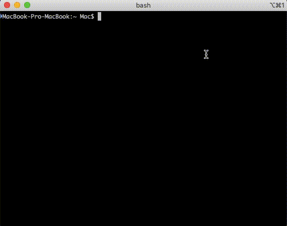
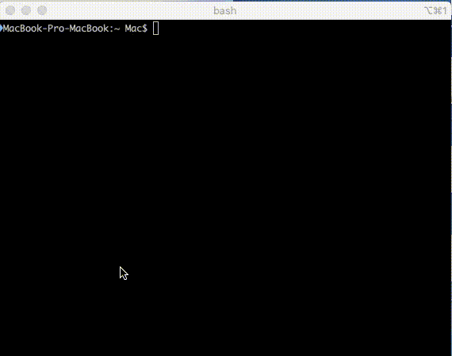

# disassembler
This project was made for corewar of 42 school
## about
The disassembler performs the task, translates the bytecode back into assembly language.
## Installation
```
git clone https://github.com/pechenovadasha/disasm.git 
```

```
`cd` in the direct/project and run `make`
```

